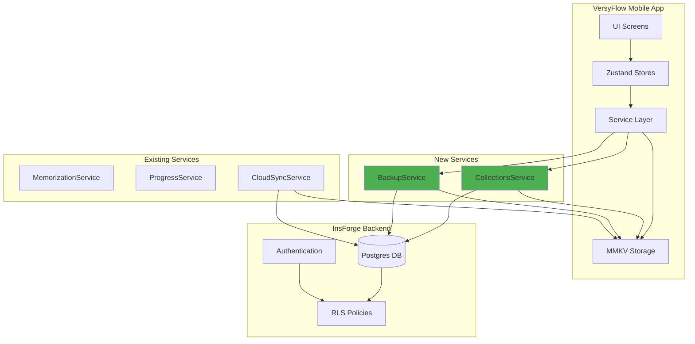
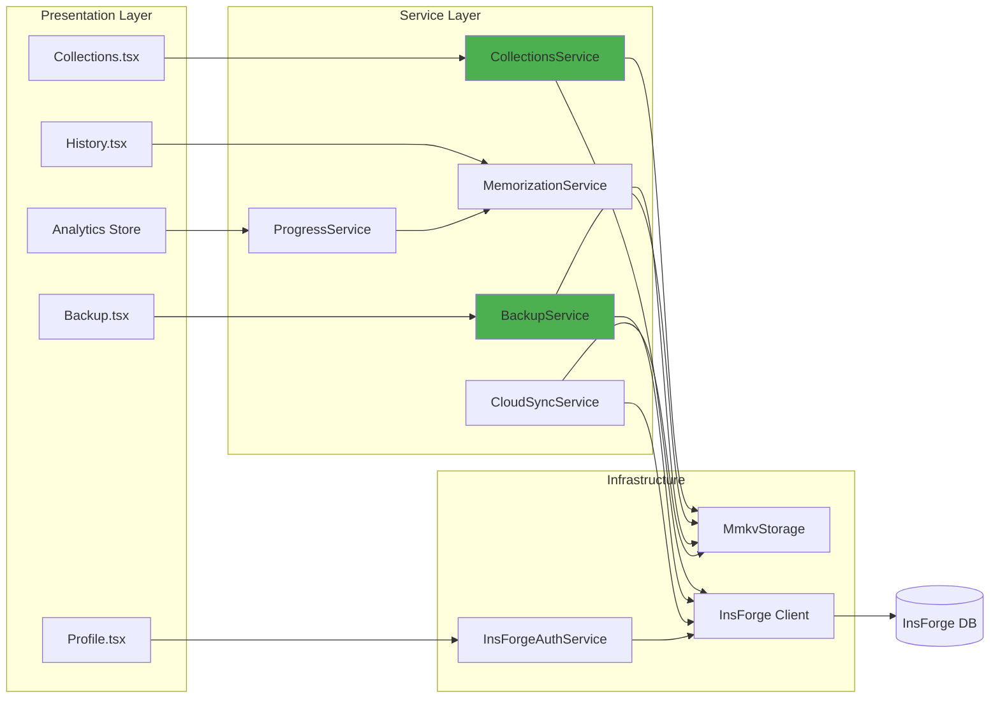
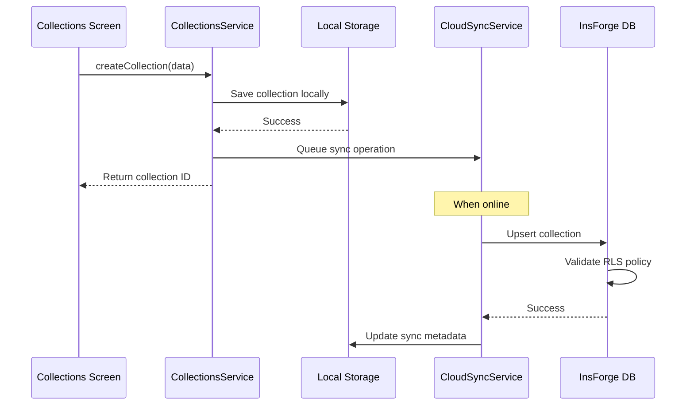
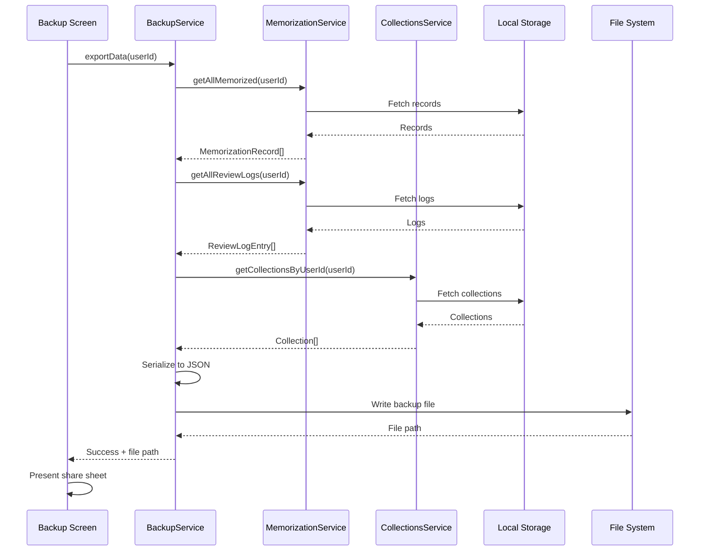

# Design Document: Data Connection Finalization

## Overview

The Data Connection Finalization feature transforms VersyFlow from a demonstration application into a production-ready Bible memorization app by connecting all UI components to the InsForge backend, implementing missing CRUD operations, and providing data portability through backup/restore functionality.

This design addresses 10 requirements spanning backend integration, service layer creation, offline synchronization, and authentication state management. The architecture maintains the existing offline-first pattern using MmkvStorage as the source of truth, with CloudSyncService handling background synchronization to InsForge Postgres.

### Key Design Principles

1. **Offline-First**: Local storage (MMKV) remains the source of truth; cloud sync is asynchronous
2. **Service Layer Separation**: New service classes (CollectionsService, BackupService) encapsulate business logic
3. **Authentication Awareness**: All backend operations validate authentication state and handle RLS policies gracefully
4. **Data Portability**: JSON-based backup format with schema versioning for forward compatibility
5. **Incremental Sync**: CloudSyncService extends existing patterns to support collection entities

## Architecture

### System Context Diagram



### Component Architecture



### Data Flow: Collection Creation



### Data Flow: Backup Export



## Components and Interfaces

### CollectionsService

The CollectionsService encapsulates all collection-related business logic, providing CRUD operations with offline-first support.

**File**: `src/services/collections-service.ts`

**Interface:**

```typescript
interface Collection {
  id: string;
  user_id: string;
  name: string;
  description: string | null;
  color: string;
  created_at: number;
  updated_at: number;
}

interface CollectionVerse {
  id: string;
  collection_id: string;
  record_id: string;
  added_at: number;
}

interface CollectionWithCount extends Collection {
  verse_count: number;
}

class CollectionsService {
  constructor(
    private storage: IStorage,
    private client: any, // InsForge client
    private profileId: string
  );

  async createCollection(params: {
    name: string;
    description?: string;
    color?: string;
  }): Promise<string>;

  async getCollectionsByUserId(userId: string): Promise<CollectionWithCount[]>;
  async getCollectionById(collectionId: string): Promise<Collection | null>;
  
  async updateCollection(
    collectionId: string,
    updates: Partial<Pick<Collection, 'name' | 'description' | 'color'>>
  ): Promise<boolean>;
  
  async deleteCollection(collectionId: string): Promise<boolean>;
  async addVerseToCollection(collectionId: string, recordId: string): Promise<boolean>;
  async removeVerseFromCollection(collectionId: string, recordId: string): Promise<boolean>;
  async getVersesInCollection(collectionId: string): Promise<MemorizationRecord[]>;
}
```

**Key Algorithms:**

1. **createCollection**: Generate UUID, save to MMKV, queue cloud sync
2. **getCollectionsByUserId**: Fetch from MMKV (offline-first), merge cloud data if online
3. **deleteCollection**: Delete collection and cascade delete verses from both MMKV and cloud
4. **Conflict Resolution**: Last-write-wins based on `updated_at` timestamp

### BackupService

The BackupService provides data export and import functionality with schema versioning.

**File**: `src/services/backup-service.ts`

**Interface:**

```typescript
interface BackupData {
  version: string; // "1.0"
  timestamp: number;
  userId: string;
  memorization_records: MemorizationRecord[];
  review_logs: ReviewLogEntry[];
  collections: Collection[];
  collection_verses: CollectionVerse[];
  settings?: Record<string, unknown>;
}

interface ImportResult {
  success: boolean;
  recordsImported: number;
  logsImported: number;
  collectionsImported: number;
  errors: string[];
}

class BackupService {
  private static readonly SCHEMA_VERSION = '1.0';

  constructor(
    private memorizationService: MemorizationService,
    private collectionsService: CollectionsService,
    private storage: IStorage
  );

  async exportData(userId: string): Promise<BackupData>;
  validateBackupFile(backup: unknown): { valid: boolean; errors: string[]; version?: string; };
  async importData(backup: BackupData): Promise<ImportResult>;
  async writeBackupToFile(backup: BackupData): Promise<string>;
  async readBackupFromFile(filePath: string): Promise<BackupData>;
}
```

**Key Algorithms:**

1. **exportData**: Aggregate all entities from services, serialize with schema version
2. **validateBackupFile**: Check schema version compatibility, validate structure
3. **importData**: Parse backup, upsert entities (preserve IDs), handle conflicts
4. **Schema Migration**: Support future versions through migration functions

## Data Models

### Collection Entity

```typescript
interface Collection {
  id: string;                // UUID
  user_id: string;           // Foreign key to auth.users
  name: string;              // Collection name (max 100 chars)
  description: string | null;// Optional description (max 500 chars)
  color: string;             // Hex color code (e.g., "#4CAF50")
  created_at: number;        // Unix timestamp (milliseconds)
  updated_at: number;        // Unix timestamp (milliseconds)
}

interface CollectionVerse {
  id: string;                // UUID
  collection_id: string;     // Foreign key to collections
  record_id: string;         // Foreign key to memorization_records
  added_at: number;          // Unix timestamp (milliseconds)
}
```

### Backup Data Structure

```typescript
interface BackupData {
  version: string;           // Schema version (e.g., "1.0")
  timestamp: number;         // Export timestamp
  userId: string;            // User who created backup
  memorization_records: MemorizationRecord[];
  review_logs: ReviewLogEntry[];
  collections: Collection[];
  collection_verses: CollectionVerse[];
  settings?: Record<string, unknown>;
}
```

## Error Handling

### Error Types

```typescript
export enum DataConnectionError {
  AUTH_REQUIRED = 'AUTH_REQUIRED',
  RLS_DENIED = 'RLS_DENIED',
  NETWORK_ERROR = 'NETWORK_ERROR',
  VALIDATION_ERROR = 'VALIDATION_ERROR',
  NOT_FOUND = 'NOT_FOUND',
  CONFLICT = 'CONFLICT',
  SCHEMA_MISMATCH = 'SCHEMA_MISMATCH',
  STORAGE_ERROR = 'STORAGE_ERROR',
}

export class DataConnectionException extends Error {
  constructor(
    public type: DataConnectionError,
    message: string,
    public cause?: unknown
  ) {
    super(message);
    this.name = 'DataConnectionException';
  }
}
```

### Error Handling Strategy

Services throw `DataConnectionException` with specific error types. UI layer catches and displays user-friendly messages with appropriate actions (e.g., redirect to login for AUTH_REQUIRED).

## Testing Strategy

### Unit Tests

**CollectionsService Tests:**
- Create collection with valid data → Success
- Create with invalid name length → VALIDATION_ERROR
- Get collections when authenticated → Returns collections
- Get collections when unauthenticated → AUTH_REQUIRED
- Update collection → Success
- Delete collection → Cascade deletes verses
- Add/remove verses → Updates collection_verses

**BackupService Tests:**
- Export with all entities → Valid BackupData
- Validate backup with correct schema → Valid
- Validate with unsupported version → SCHEMA_MISMATCH
- Import valid backup → All entities restored
- Import with ID conflicts → Updates existing
- Import invalid data → Errors array populated

**ProgressService Integration:**
- calculateStats → Returns real data from storage
- getWeeklyTrend → Calculates this week vs last week
- calculateStreak → Counts consecutive days

### Integration Tests

- Review History screen loads real logs from backend
- Collections screen performs CRUD operations
- Profile update persists to users table
- Backup export/import round-trip preserves all data
- Analytics screen displays real statistics
- Offline mode queues operations for sync
- Authentication errors redirect to login


## Correctness Properties

Property-based testing is not applicable to this feature because:

1. **External Service Integration**: The feature primarily tests integration with InsForge backend, not pure business logic
2. **I/O Operations**: Backup/restore involves file system operations which are side-effect-heavy
3. **Simple CRUD**: Collection operations are straightforward create/read/update/delete without complex algorithmic behavior
4. **Infrastructure Wiring**: Most requirements verify that components are correctly connected to backend services

The testing strategy will use **integration tests** with representative examples and **mock-based unit tests** for service layer logic.

## Testing Strategy

### Test Approach

This feature requires **integration testing** as the primary strategy because the requirements focus on verifying correct data flow between UI, services, local storage, and backend rather than algorithmic correctness.

### Unit Tests (Mock-Based)

**CollectionsService** (`collections-service.test.ts`):

```typescript
describe('CollectionsService', () => {
  let service: CollectionsService;
  let mockStorage: jest.Mocked<IStorage>;
  let mockClient: jest.Mocked<any>;

  beforeEach(() => {
    mockStorage = {
      get: jest.fn(),
      set: jest.fn(),
      delete: jest.fn(),
      getAllKeys: jest.fn(),
      clear: jest.fn(),
    };
    mockClient = {
      from: jest.fn().mockReturnThis(),
      insert: jest.fn().mockReturnThis(),
      select: jest.fn().mockReturnThis(),
      update: jest.fn().mockReturnThis(),
      delete: jest.fn().mockReturnThis(),
      eq: jest.fn().mockReturnThis(),
    };
    service = new CollectionsService(mockStorage, mockClient, 'user-123');
  });

  it('should create collection with valid data', async () => {
    const id = await service.createCollection({
      name: 'Test Collection',
      description: 'Test',
      color: '#4CAF50',
    });

    expect(id).toBeDefined();
    expect(mockStorage.set).toHaveBeenCalled();
  });

  it('should throw VALIDATION_ERROR for name > 100 chars', async () => {
    await expect(
      service.createCollection({ name: 'a'.repeat(101) })
    ).rejects.toThrow(DataConnectionException);
  });

  it('should get collections with verse counts', async () => {
    mockStorage.getAllKeys.mockResolvedValue([
      'versyflow:user-123:collection:id-1',
    ]);
    mockStorage.get.mockResolvedValueOnce(
      JSON.stringify({ id: 'id-1', name: 'Test', user_id: 'user-123' })
    );
    mockStorage.get.mockResolvedValueOnce(JSON.stringify([]));

    const collections = await service.getCollectionsByUserId('user-123');

    expect(collections).toHaveLength(1);
    expect(collections[0].verse_count).toBe(0);
  });

  it('should delete collection and cascade verses', async () => {
    mockStorage.get.mockResolvedValue(JSON.stringify({ id: 'id-1' }));
    
    const result = await service.deleteCollection('id-1');

    expect(result).toBe(true);
    expect(mockStorage.delete).toHaveBeenCalledTimes(2); // collection + verses
  });
});
```

**BackupService** (`backup-service.test.ts`):

```typescript
describe('BackupService', () => {
  let service: BackupService;
  let mockMemService: jest.Mocked<MemorizationService>;
  let mockCollService: jest.Mocked<CollectionsService>;
  let mockStorage: jest.Mocked<IStorage>;

  beforeEach(() => {
    mockMemService = {
      getAllMemorized: jest.fn(),
      getAllReviewLogs: jest.fn(),
    } as any;
    mockCollService = {
      getCollectionsByUserId: jest.fn(),
    } as any;
    mockStorage = {
      get: jest.fn(),
      set: jest.fn(),
    } as any;
    service = new BackupService(mockMemService, mockCollService, mockStorage);
  });

  it('should export data with all entities', async () => {
    mockMemService.getAllMemorized.mockResolvedValue([
      { id: 'rec-1', bibleVerseText: 'John 3:16' } as any,
    ]);
    mockMemService.getAllReviewLogs.mockResolvedValue([
      { id: 'log-1', recordid: 'rec-1' } as any,
    ]);
    mockCollService.getCollectionsByUserId.mockResolvedValue([
      { id: 'col-1', name: 'Favorites', verse_count: 1 } as any,
    ]);

    const backup = await service.exportData('user-123');

    expect(backup.version).toBe('1.0');
    expect(backup.userId).toBe('user-123');
    expect(backup.memorization_records).toHaveLength(1);
    expect(backup.review_logs).toHaveLength(1);
    expect(backup.collections).toHaveLength(1);
  });

  it('should validate backup with correct schema', () => {
    const validBackup = {
      version: '1.0',
      timestamp: Date.now(),
      userId: 'user-123',
      memorization_records: [],
      review_logs: [],
      collections: [],
      collection_verses: [],
    };

    const result = service.validateBackupFile(validBackup);

    expect(result.valid).toBe(true);
    expect(result.errors).toHaveLength(0);
  });

  it('should reject unsupported schema version', () => {
    const invalidBackup = {
      version: '99.0',
      timestamp: Date.now(),
      userId: 'user-123',
      memorization_records: [],
      review_logs: [],
      collections: [],
      collection_verses: [],
    };

    const result = service.validateBackupFile(invalidBackup);

    expect(result.valid).toBe(false);
    expect(result.errors).toContain('Unsupported schema version: 99.0');
  });

  it('should import data and return statistics', async () => {
    const backup: BackupData = {
      version: '1.0',
      timestamp: Date.now(),
      userId: 'user-123',
      memorization_records: [{ id: 'rec-1' } as any],
      review_logs: [{ id: 'log-1' } as any],
      collections: [{ id: 'col-1' } as any],
      collection_verses: [],
    };

    const result = await service.importData(backup);

    expect(result.success).toBe(true);
    expect(result.recordsImported).toBe(1);
    expect(result.logsImported).toBe(1);
    expect(result.collectionsImported).toBe(1);
  });
});
```

### Integration Tests

**Review History Backend Connection** (`review-history.integration.test.ts`):

```typescript
describe('Review History Backend Integration', () => {
  it('should load real review logs from backend', async () => {
    // Setup: Create test user and memorization record
    const userId = await createTestUser();
    const recordId = await createTestRecord(userId);
    await createTestReviewLog(recordId, FsrsRating.GOOD);

    // Execute: Load History screen
    const { getByText } = render(<HistoryScreen />, {
      initialParams: { recordId },
    });

    // Verify: Displays actual review log
    await waitFor(() => {
      expect(getByText(/Bon/)).toBeDefined(); // Rating label
    });
  });

  it('should display empty state when no logs exist', async () => {
    const userId = await createTestUser();
    const recordId = await createTestRecord(userId);

    const { getByText } = render(<HistoryScreen />, {
      initialParams: { recordId },
    });

    await waitFor(() => {
      expect(getByText(/pas encore révisé/i)).toBeDefined();
    });
  });
});
```

**Collections CRUD Operations** (`collections.integration.test.ts`):

```typescript
describe('Collections Backend Integration', () => {
  it('should create collection and persist to backend', async () => {
    const userId = await createTestUser();
    loginAsUser(userId);

    const service = new CollectionsService(storage, client, userId);
    const id = await service.createCollection({
      name: 'My Favorites',
      color: '#4CAF50',
    });

    // Verify local storage
    const local = await service.getCollectionById(id);
    expect(local).toBeDefined();
    expect(local?.name).toBe('My Favorites');

    // Verify backend
    const { data } = await client.from('collections').select('*').eq('id', id);
    expect(data).toHaveLength(1);
    expect(data[0].name).toBe('My Favorites');
  });

  it('should delete collection and cascade verses', async () => {
    const userId = await createTestUser();
    const collectionId = await createTestCollection(userId, 'Test');
    const recordId = await createTestRecord(userId);
    await addVerseToCollection(collectionId, recordId);

    const service = new CollectionsService(storage, client, userId);
    await service.deleteCollection(collectionId);

    // Verify collection deleted
    const collection = await service.getCollectionById(collectionId);
    expect(collection).toBeNull();

    // Verify verses cascade deleted
    const { data } = await client
      .from('collection_verses')
      .select('*')
      .eq('collection_id', collectionId);
    expect(data).toHaveLength(0);
  });
});
```

**Profile Update** (`profile.integration.test.ts`):

```typescript
describe('Profile Update Integration', () => {
  it('should update display_name in users table', async () => {
    const userId = await createTestUser();
    loginAsUser(userId);

    const authService = new InsForgeAuthService();
    await authService.updateUserProfile(userId, {
      display_name: 'John Doe',
    });

    // Verify backend
    const { data } = await client.from('users').select('*').eq('id', userId);
    expect(data[0].display_name).toBe('John Doe');
  });

  it('should validate display_name length', async () => {
    const userId = await createTestUser();
    const authService = new InsForgeAuthService();

    await expect(
      authService.updateUserProfile(userId, {
        display_name: 'a'.repeat(101),
      })
    ).rejects.toThrow(/1-100 characters/);
  });
});
```

**Backup Export/Import Round-Trip** (`backup.integration.test.ts`):

```typescript
describe('Backup Export/Import Integration', () => {
  it('should export and import all user data', async () => {
    // Setup: Create test data
    const userId = await createTestUser();
    const recordId = await createTestRecord(userId);
    await createTestReviewLog(recordId, FsrsRating.GOOD);
    const collectionId = await createTestCollection(userId, 'Favorites');
    await addVerseToCollection(collectionId, recordId);

    // Export
    const backupService = new BackupService(memService, collService, storage);
    const backup = await backupService.exportData(userId);

    expect(backup.memorization_records).toHaveLength(1);
    expect(backup.review_logs).toHaveLength(1);
    expect(backup.collections).toHaveLength(1);
    expect(backup.collection_verses).toHaveLength(1);

    // Clear data
    await clearUserData(userId);

    // Import
    const result = await backupService.importData(backup);

    expect(result.success).toBe(true);
    expect(result.recordsImported).toBe(1);
    expect(result.logsImported).toBe(1);
    expect(result.collectionsImported).toBe(1);

    // Verify data restored
    const records = await memService.getAllMemorized(userId);
    expect(records).toHaveLength(1);
    expect(records[0].id).toBe(recordId);
  });

  it('should handle import with ID conflicts', async () => {
    const userId = await createTestUser();
    const recordId = await createTestRecord(userId);

    const backup: BackupData = {
      version: '1.0',
      timestamp: Date.now(),
      userId,
      memorization_records: [{ id: recordId, bibleVerseText: 'Updated' } as any],
      review_logs: [],
      collections: [],
      collection_verses: [],
    };

    const result = await backupService.importData(backup);

    expect(result.success).toBe(true);

    // Verify existing record updated
    const record = await memService.getMemorizedRecord(
      'Genesis',
      1,
      1,
      'LSG',
      userId
    );
    expect(record?.bibleVerseText).toBe('Updated');
  });
});
```

**Analytics Integration** (`analytics.integration.test.ts`):

```typescript
describe('Analytics ProgressService Integration', () => {
  it('should calculate real statistics from storage', async () => {
    const userId = await createTestUser();
    await createTestRecord(userId); // New record
    await createTestRecord(userId, 'mastered'); // Mastered record

    const progressService = new ProgressService(memService, fsrsEngine, null, userId);
    const stats = await progressService.getStats();

    expect(stats.totalVerses).toBe(2);
    expect(stats.masteredVerses).toBe(1);
    expect(stats.inProgressVerses).toBe(1);
  });

  it('should calculate streak from review logs', async () => {
    const userId = await createTestUser();
    const recordId = await createTestRecord(userId);
    
    // Create reviews for consecutive days
    const today = Date.now();
    await createTestReviewLog(recordId, FsrsRating.GOOD, today);
    await createTestReviewLog(recordId, FsrsRating.GOOD, today - 86400000);
    await createTestReviewLog(recordId, FsrsRating.GOOD, today - 86400000 * 2);

    const progressService = new ProgressService(memService, fsrsEngine, null, userId);
    const streak = await progressService.calculateStreak();

    expect(streak).toBe(3);
  });
});
```

**Offline Sync Queue** (`offline-sync.integration.test.ts`):

```typescript
describe('Offline Synchronization', () => {
  it('should queue collection operations when offline', async () => {
    const userId = await createTestUser();
    
    // Simulate offline
    mockNetInfo({ isConnected: false });

    const service = new CollectionsService(storage, client, userId);
    const id = await service.createCollection({ name: 'Offline Collection' });

    // Verify saved locally
    const local = await storage.get(`versyflow:${userId}:collection:${id}`);
    expect(local).toBeDefined();

    // Verify NOT in backend yet
    const { data } = await client.from('collections').select('*').eq('id', id);
    expect(data).toHaveLength(0);

    // Simulate online and trigger sync
    mockNetInfo({ isConnected: true });
    await syncService.syncOnce();

    // Verify synced to backend
    const { data: synced } = await client.from('collections').select('*').eq('id', id);
    expect(synced).toHaveLength(1);
  });
});
```

### Test Coverage Goals

- **Unit Tests**: 80% coverage for service layer (CollectionsService, BackupService)
- **Integration Tests**: All 10 requirements have at least 2 integration tests (happy path + error case)
- **E2E Tests**: Smoke tests for critical user flows (create collection, export backup, view history)

### Test Execution Strategy

1. **Development**: Run unit tests on every commit
2. **CI/CD**: Run integration tests on pull requests
3. **Pre-Release**: Run full E2E test suite including backend integration
4. **Staging**: Verify backup/restore with production-like data volumes

