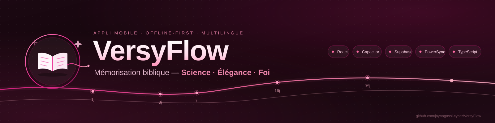

# VersyFlow

<div align="center">
  
</div>

<div align="center">

**Mémorisation biblique intuitive — Science • Élégance • Foi**

[](https://reactnative.dev/)
[](https://expo.dev/)
[](https://www.typescriptlang.org/)
[](https://www.rust-lang.org/)
[](LICENSE)

</div>

---

## 📖 À propos

**VersyFlow** est une application mobile de mémorisation des versets bibliques conçue pour offrir une expérience **élégante, scientifique et deeply spirituelle**.

Elle combine :
- Un **moteur FSRS (Free Spaced Repetition Scheduler)** écrit en Rust pour une précision maximale de mémorisation
- Une architecture **React Native + Expo** pour une compatibilité multiplateforme fluide
- Un support **multilingue** dès la conception (interface + traductions bibliques indépendantes)
- Une approche **offline-first** totale

## 🚀 Caractéristiques principales

### MVP (V0.1)
| Fonctionnalité | Statut |
|---|---|
| Onboarding multilingue | ✅ Implémenté |
| Navigation biblique (Livres → Chapitres → Versets) | ✅ Implémenté |
| Session de mémorisation interactive | ✅ Implémenté |
| Moteur FSRS intégré (via WASM) | ✅ Implémenté |
| Révisions pilotées par FSRS | ✅ Implémenté |
| Suivi de progression | ✅ Implémenté |
| Design System "Rose & Frais" | ✅ Implémenté |

### V1+ (Roadmap)
- Multi-traductions bibliques (LSG, KJV, NIV, NASB...)
- Synchronisation cloud
- Notifications intelligentes
- Fonctionnalités sociales
- Mode audio
- Thèmes personnalisables

## 🏗️ Architecture

```
VersyFlow/
├── app/                    # Écrans Expo Router
├── src/
│   ├── components/         # Composants UI réutilisables (view uniquement)
│   ├── domains/            # Couche domaine (Bible, FSRS, i18n)
│   ├── services/           # Services métier (Repository pattern)
│   ├── hooks/              # Custom React hooks
│   ├── store/              # State management
│   └── utils/              # Utilitaires
├── rust/                   # Code Rust (FSRS engine)
├── tests/                  # Tests unitaires et e2e
└── docs/                   # Documentation complète du projet
```

Voir [docs/09-architecture.md](docs/09-architecture.md) pour l'architecture détaillée.

## 📚 Documentation

Toute la documentation du projet se trouve dans le dossier `docs/` :

| Document | Description |
|----------|-------------|
| [01-vision-produit.md](docs/01-vision-produit.md) | Vision, cible, différenciation |
| [02-principes-produit.md](docs/02-principes-produit.md) | Principes architecturaux non négociables |
| [03-prd.md](docs/03-prd.md) | Product Requirements Document |
| [04-user-flows.md](docs/04-user-flows.md) | Parcours utilisateur |
| [05-features.md](docs/05-features.md) | Fonctionnalités MVP/V1/Futur |
| [06-design-system.md](docs/06-design-system.md) | Design System complet |
| [07-design-tokens.md](docs/07-design-tokens.md) | Design Tokens |
| [08-ui-screens.md](docs/08-ui-screens.md) | Spécifications écrans UI |
| [09-architecture.md](docs/09-architecture.md) | Architecture technique |
| [10-data-model.md](docs/10-data-model.md) | Modèle de données |
| [11-bible-domain.md](docs/11-bible-domain.md) | Domaine biblique |
| [12-internationalization.md](docs/12-internationalization.md) | Internationalisation |
| [13-fsrs-domain.md](docs/13-fsrs-domain.md) | Domaine FSRS |
| [14-folder-structure.md](docs/14-folder-structure.md) | Structure des dossiers |
| [15-implementation-plan.md](docs/15-implementation-plan.md) | Plan d'implémentation |
| [16-ai-dev-guide.md](docs/16-ai-dev-guide.md) | Guide développement IA |
| [17-workflows-systeme.md](docs/17-workflows-systeme.md) | Workflows système |

## 🛠️ Prérequis

| Outil | Version minimale |
|-------|-----------------|
| Node.js | >= 18.x |
| npm / pnpm | >= 9.x |
| Expo CLI | >= 16.x |
| Rust | >= 1.75 (pour compilation WASM) |
| Xcode | >= 15 (iOS targeting) |
| Android Studio | >= 2023 (API 26 targeting) |

## 🏁 Démarrage rapide

```bash
# 1. Cloner le projet
git clone https://github.com/joynagassi-cyber/VersyFlow.git
cd VersyFlow

# 2. Installer les dépendances
npm install
# ou
pnpm install

# 3. Lancer l'application
npx expo start

# 4. Ouvrir sur un émulateur
npx expo run:ios   # iOS
npx expo run:android  # Android
```

## 🧪 Tests

```bash
# Tests unitaires
npm test

# Tests e2e
npm run test:e2e

# Vérification TypeScript
npm run typecheck
```

## 📝 Conventions

- **Code style** : ESLint + Prettier (voir `.eslintrc.js`)
- **Git** : Conventional Commits (`feat:`, `fix:`, `docs:`, etc.)
- **Architecture** : Clean Architecture, Dependency Inversion
- **Nommage** : PascalCase composants, camelCase variables/hooks, UPPER_CASE constantes
- **Types** : Strict TypeScript (noImplicitAny)

## 🌍 Internationalisation

VersyFlow est conçu dès le départ pour être multilingue :

- **Langues de l'interface** : Français, Anglais, Arabe (RTL), Allemand, Chinois...
- **Traductions bibliques** : LSG (MVP), extensible à KJV, NIV, NASB...
- La langue UI et la traduction biblique sont **complètement indépendantes**

Voir [docs/12-internationalization.md](docs/12-internationalization.md) pour plus de détails.

## 🤝 Contribuer

Les contributions sont les bienvenues ! Veuillez lire notre guide de développement dans [docs/16-ai-dev-guide.md](docs/16-ai-dev-guide.md).

1. Fork le projet
2. Créer une branche (`feature/nouvelle-fonctionnalite`)
3. Commit vos changements (`feat: ...`)
4. Pusher vers la branche
5. Ouvrir une Pull Request

## 📄 Licence

Ce projet est sous licence MIT. Voir [LICENSE](LICENSE) pour plus de détails.

---

<div align="center">

**VersyFlow** — *La science de la mémorisation au service de la Parole*

Made with ❤️ et foi • React Native • Expo • Rust • FSRS

</div>
