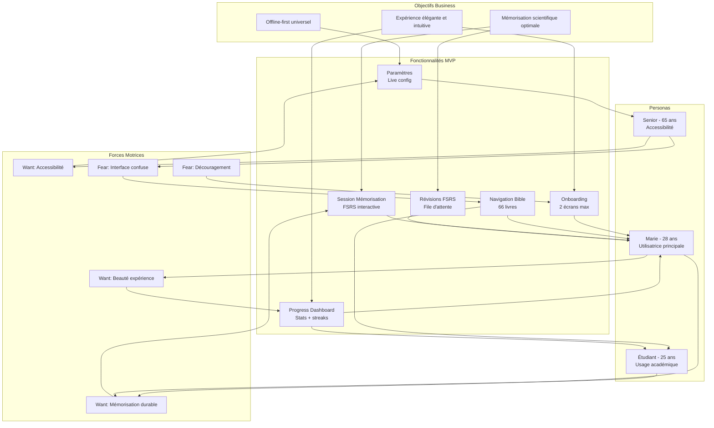

# VersyFlow — Trigger Map

**Projet**: VersyFlow — Application mobile de mémorisation biblique FSRS
**Date**: 2026-08-03
**Version**: MVP v0.1

---

## 1. Business Goals

### Objectif Principal (Primary)
**Offrir une expérience de mémorisation biblique scientifiquement optimale et esthétiquement élégante**

### Objectifs Secondaires (Secondary)
- Maximiser la rétention à long terme grâce au moteur FSRS
- Créer une interface intuitive nécessitant < 3 clics pour mémoriser
- Garantir un fonctionnement 100% offline

### Objectifs Tertiaires (Tertiary)
- Support multilingue (5 langues UI + traductions bibliques multiples)
- Accessibilité WCAG 2.1 AA
- Architecture modulaire pour extensibilité future

---

## 2. Personas

### Persona Principal: Marie
- **Rôle**: Utilisatrice principale, core target
- **Top Drivers**:
  1. 🟢 Veut mémoriser durablement sans effort mécanique
  2. 🟢 Apprécie les belles interfaces et le design soigné
  3. 🟢 Cherche une expérience spirituelle profonde et personnelle
- **Top Fears**:
  1. 🔴 Abandonner la mémorisation par découragement
  2. 🔴 Interface confuse ou frustrante
  3. 🔴 Perdre sa progression si changement de téléphone
- **Driving Forces**:
  - Méditation personnelle quotidienne
  - Croissance spirituelle
  - Esthétisme et qualité perçue
- **Flywheel Role**: Utilisatrice régulière → partagé via recommandation → nouvelles installations

### Persona Secondaire: Étudiant en théologie
- **Rôle**: Utilisateur académique
- **Top Drivers**:
  1. 🟢 Besoin de mémorisation approfondie pour étude
  2. 🟢 Précision des données (intervalles optimaux)
  3. 🟢 Possibilité de comparer traductions
- **Top Fears**:
  1. 🔴 Algorithme trop simpliste
  2. 🔴 Manque de rigueur scientifique
  3. 🔴 Limitations dans les recherches
- **Driving Forces**:
  - Excellence académique
  - Mémorisation pour enseignement
- **Flywheel Role**: Influencer auprès des pairs → adoption communautaire

### Persona Tertiaire: Chrétien senior
- **Rôle**: Utilisateur occasionnel, besoin d'accessibilité
- **Top Drivers**:
  1. 🟢 Interface simple et lisible
  2. 🟢 Fonctionnement offline total
  3. 🟢 Pas de complexité technique
- **Top Fears**:
  1. 🔴 Difficulté à utiliser l'application
  2. 🔴 Dépendance à internet
  3. 🔴 Confusion dans la navigation
- **Driving Forces**:
  - Régularité de pratique
  - Simplicité d'usage
- **Flywheel Role**: Recommandation à la communauté → bouche-à-oreille

---

## 3. Driving Forces (Forces Motrices)

### Forces Positives (Wants)
| Force | Description | Impact |
|-------|-------------|--------|
| F-P1 | Mémorisation durable et scientifique | FSRS comme différenciateur clé |
| F-P2 | Beauté de l'expérience | Design premium rose/frais |
| F-P3 | Accessibilité universelle | 5 langues, RTL, WCAG AA |
| F-P4 | Indépendance (offline) | Aucune connexion requise |
| F-P5 | Progression visuelle | Stats, streaks, motivation |

### Forces Négatives (Fears)
| Force | Description | Impact |
|-------|-------------|--------|
| F-N1 | Découragement face à la difficulté | Abandon précace |
| F-N2 | Interface confuse ou lente | Frustration, désinstallation |
| F-N3 | Perte de données | Confiance compromise |
| F-N4 | Algorithmes trop simplistes | Perceived as amateur tool |

---

## 4. Feature Assessment

### Features Prioritaires

| Feature | Persona | Business Goal | Impact | Priority |
|---------|---------|---------------|--------|----------|
| Onboarding | Marie | Mémorisation easy-start | HIGH | MUST |
| Bible Navigation | Tous | Accès au contenu | HIGH | MUST |
| Memorization Session | Marie | Cœur du produit | HIGH | MUST |
| FSRS Engine | Étudiant | Différenciation scientifique | HIGH | MUST |
| Review Queue | Marie | Rétention optimale | HIGH | MUST |
| Progress Dashboard | Tous | Motivation continue | MEDIUM | SHOULD |
| Settings | Tous | Personnalisation | MEDIUM | MUST |

### Feature-Goal Mapping
```
Onboarding → F-P1 (easy start) → Primary Goal
Bible Nav → F-P4 (access) → Secondary Goal
Memorization → F-P1 (scientific retention) → Primary Goal
FSRS Engine → F-P1 (scientific) + F-P2 (quality) → Primary Goal
Review Queue → F-P1 (retention) → Primary Goal
Progress → F-P5 (motivation) → Secondary Goal
Settings → F-P3 (accessibility) → Tertiary Goal
```

---

## 5. Key Insights

### Insight 1: FSRS est le vrai différenciateur
Les apps bibliques existantes utilisent des algorithmes basiques. Le moteur FSRS (Rust) offre une précision scientifique supérieure qui justifie le positionnement premium.

**Implication UX**: Mettre en avant les stats de précision et l'aspect scientifique dans l'onboarding et le dashboard.

### Insight 2: Le design "sacré moderne" est unique
Le rose premium n'est pas juste esthétique — il positionne VersyFlow comme différent de YouVersion (fonctionnel) et Calm (méditatif). C'est un équilibre entre sacré et contemporain.

**Implication UX**: Chaque écran doit respirer cet équilibre — espacement généreux, typographie élégante, micro-interactions douces.

### Insight 3: Offline-first est un argument de vente
Beaucoup d'utilisateurs chrétiens lisent la Bible dans des contextes sans connexion (rural, voyage). Le 100% offline est un avantage concurrentiel majeur.

**Implication UX**: Pas d'indicateur "no internet" — l'app fonctionne toujours, c'est implicite.

### Insight 4: < 3 clics pour mémoriser
La vitesse d'accès à la fonctionnalité principale est critique. Si c'est trop long, l'utilisateur abandonne.

**Implication UX**: Home → Explorer → Select verse → "Memorize" doit être le parcours le plus rapide possible.

---

## 6. Navigation Structure

### Bottom Tab Navigation (4 tabs)
```
┌─────────────────────────────────────────┐
│  [🏠 Accueil] [🔍 Explorer] [📊 Progress] [⚙️ Paramètres] │
└─────────────────────────────────────────┘
```

### Écrans par Tab

#### Tab 1: Accueil
- Dashboard rapide (versets à réviser, streak, prochain intervalle)
- Actions rapides: "Mémoriser un verset" / "Réviser maintenant"
- Versets récents / à renforcer

#### Tab 2: Explorer
- Navigation Bible: Livres → Chapitres → Versets
- Recherche par référence
- Favoris

#### Tab 3: Progression
- Dashboard stats complet
- Graphique hebdomadaire
- Versets par statut (nouveau, en cours, maîtrisé)
- Streak counter

#### Tab 4: Paramètres
- Langue UI
- Traduction biblique
- Stockage utilisé
- Reset progression

---

## 7. Mermaid Diagram



---

*Document généré depuis la documentation existante (docs/01-vision-produit.md, docs/03-prd.md, docs/05-features.md).*